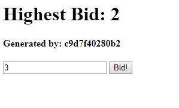

# IaaS Lab

In diesem Lab lernt ihr wie man eine Anwendung in die AWS Cloud bringt und Load Balancing einrichtet.

Ziel:

- Umgang mit Amazon EC2 lernen
- Load Balancing

## Vorbereitung

Damit ihr dieses Lab durchspielen könnt, benötigt ihr ein AWS Account.
Ein AWS Account kann als Student gratis bestellt werden inkl. Guthaben (es wird keine Kreditkarte benötigt).
Es dauert ca. 2 Tage, bis euer Account aktiviert wird.

1. https://www.awseducate.com/registration#APP_TYPE
2. Student auswählen
3. Mit BFH Mail Adresse anmelden.

Mehr dazu unter https://aws.amazon.com/de/education/awseducate/

## Ablauf

Ziel des Labs ist es, die Bid-App (App für Auktionen) in der AWS Cloud zu deplyoen.
Dabei sollen EC2 Instanzen verwendet werden ohne Amazon Container Service oder andere Services.



## 1. Anwendung auf einer Instanz deployen

1. EC2 Instanz erstellen z.B. Amazon Linux 2 AMI
2. Per SSH auf Instanz einloggen.
   Unter Windows z.B. mit PuTTY https://docs.aws.amazon.com/de_de/AWSEC2/latest/UserGuide/putty.html oder Git Bash
3. Docker auf der EC2 Instanz installieren

```sh
# Aktualisieren der installierten Pakete und des Caches der Paketverwaltung auf der Instanz
sudo yum update -y

# Docker installieren
sudo yum install -y docker

# Docker beim Booten starten
sudo systemctl enable docker
sudo systemctl start docker

# Damit docker Befehle ohne sudo ausgeführt werden können
sudo usermod -a -G docker ec2-user
```

4. Abmelden und wieder anmelden, damit die Berechtigungen übernommen werden
5. Docker Installation prüfen `docker info`
6. Bid Applikation Starten

```sh
docker run -p 80:80 -d fluescher/cascld
```

7. Prüfen ob die Anwendung läuft `curl localhost`

8. Security Group einrichten damit die Anwendung unter Port 80 erreichbar ist.

9. Webseite sollte nun über das Interent erreichbar sein

### Problem

Läuft die Anwendung noch, wenn ihr den Server neustartet?

## 2. Bid Applikation als Linux Service laufen lassen

1. Datei `bid-service.service` auf den Server kopieren z.B. mit scp

```sh
scp ./bid-service.service ec2-user@YOUR-AWS-SERVER:~
```

2. Service aktivieren

```sh
sudo systemctl enable /home/ec2-user/bid-service.service
```

3. Server neustarten

4. Anwendung sollte nach dem Neustart immer noch erreichbar sein

## 3. Zweite Instanz erstellen und Load Balancing einrichten

1. AMI erzeugen

2. Neue Instanz mit AMI starten

3. Prüfen ob ihr mit dem Browser auf die Webseite kommt. Ihr solltet jezt die Applikation auf zwei Instanzen am laufen haben.

4. Load Balancer erstellen

5. Anschliessend solltet ihr bei jedem Aufruf abwechslungsweise auf die Eine oder die Andere Instanz geroutet werden.

6. Security Groups prüfen und wenn nötig anpassen z.B. das nur noch der Load Balancer per HTTP auf die Instanzen kommt

Versucht folgende Fragen zu beantworten:

- Was passiert wenn ihr ein Gebot abgibt?
- Habt ihr das gleiche "Highest Bid" bei beiden Webseites? Warum nicht?

Dieses Problem wird in der Bonus Übung (Redis) gelöst.

## 4. Bonus: Auto Scaling

Erstellt eine Auto Scaling Group, damit bei vielen Anfragen automatisch eine neue Instanz gestartet wird und wenn es wieder weniger Anfragen gibt, automatisch eine Instanz beendet wird.

## 5. Bonus: Redis

Das Load Balancing müsste nun funkionieren, aber die Anwendungen haben keine gemeinsame Datenbank und speichern die Daten zur Zeit lokal im Memory. Ziel dieser Übung ist es, dass die Bid App die Daten in eine gemeinsame Redis Datenbank speichert.

Bei der Bid App kann über eine Umgebungsvariable gesteuert werden, welche Datenbank verwendet werden soll. Siehe https://github.com/fluescher/cascld-kubernetes/blob/master/sampleapp/docker-compose.yml

Um Redis in der AWS Cloud zu betreiben, könnt ihr z.B. Amazon ElastiCache verwenden https://aws.amazon.com/de/elasticache/
