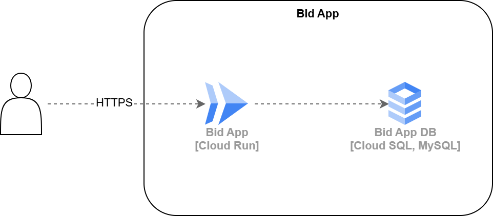

# Bid App mit Terraform

Das Management der Bid App möchte die Verwaltung der Infrastruktur professionalisieren und automatisieren. Deshalb hat es das Bid App Team beauftragt, Infrastructure as Code (IaC) einzusetzen. Das Team hat sich entschieden, dafür **Terraform** zu verwenden.

## Ziel

Das Ziel dieser Übung ist es, die **Bid App** mithilfe von Terraform in der **Google Cloud Platform (GCP)** zu deployen – wie in der untenstehenden Abbildung dargestellt.



## 0. Neues Projekt

Erstelle ein neues Google Cloud Projekt.

## 1. Docker Image in die Google Cloud Container Registry

Damit eine Anwendung über Google Cloud Run deployt werden kann, muss das Dockerimage in der Google Cloud Registry vorhanden sein.

1. Google Cloud Shell aktivieren
2. Docker Authentification konfigurieren

```sh
gcloud auth configure-docker
```

3. Dockerimage in die Cloud Registry pushen. Dazu `PROJECTID` mit eurer GCP Project ID ersetzen.

```sh
# Aktiviere die Container Registry
gcloud services enable artifactregistry.googleapis.com

# Hole das Image vom Dockerhub
docker pull ghcr.io/dsi-engineering-ag/kubernetes-hands-on-sampleapp:latest

docker tag ghcr.io/dsi-engineering-ag/kubernetes-hands-on-sampleapp:latest gcr.io/PROJECTID/bid-app

# Pushe das Image in die Google Container Registry
docker push gcr.io/PROJECTID/bid-app
```

Aktiviere weitere benötigte Services. Dieser Schritt wäre auch über Terraform möglich.

```sh
gcloud services enable run.googleapis.com cloudbuild.googleapis.com sql-component.googleapis.com sqladmin.googleapis.com
```

## 2. Cloud Run

1. Erstelle den Order `bidapp`. Dieser Order soll für alle Terraform Dateien in dieser Übung verwendet werden.

2. Erstelle die Datei `variables.tf` mit diesem Inhalt:

```terraform
variable "project" {
  description = "GCP Project ID"
  type        = string
}

variable "region" {
  description = "Region to deploy Cloud Run service (e.g., us-central1)"
  type        = string
  default     = "europe-west6"
}
```

3. Erstelle die Datei `terraform.tfvars` mit diesem Inhalt:

```terraform
project = "PROJECTID"
```

4. Erstelle die Datei `main.tf` mit diesem Inhalt:

```terraform
terraform {
  required_providers {
    google = {
      source  = "hashicorp/google"
      version = "6.8.0"
    }
  }
}

provider "google" {
  project = var.project
  region  = var.region
}

resource "google_cloud_run_service" "default" {
  name     = "bidapp"
  location = var.region

  template {
    spec {
      containers {
        image = "gcr.io/${var.project}/bid-app:latest"
      }
    }
  }

  traffic {
    percent         = 100
    latest_revision = true
  }
}

# Allow unauthenticated access
resource "google_cloud_run_service_iam_member" "noauth" {
  location = google_cloud_run_service.default.location
  project  = var.project
  service  = google_cloud_run_service.default.name
  role     = "roles/run.invoker"
  member   = "allUsers"
}

output "cloud_run_url" {
  value = google_cloud_run_service.default.status[0].url
}
```

5. Führe diese Befehle durch:

```sh
terraform init
terraform apply
```

Anschliessend sollte die Bid App über die URL welche im Output ausgeben wird erreichbar sein.

## 3. Database

Im nächsten Schritt geht es darum, analog zu [PaaS Database](./../paas-2/database.md) eine MySQL Datenbank mit dem entsprechenden Datenbank Schema zu erstellen. Natürlich mit Terraform anstatt über das Google Cloud CLI.

1. Erstelle zwei neue Variablen in der Datei `variables.tf`:

```terraform
variable "root_password" {
  description = "Root password for the MySQL instance"
  type        = string
  sensitive   = true
}

variable "bidapp_password" {
  description = "Password for the bidapp database user"
  type        = string
  sensitive   = true
}
```

2. Erstelle die Datei `database.tf` mit diesem Inhalt:

```terraform
resource "google_sql_database_instance" "bid_db" {
  name             = "bid-db"
  database_version = "MYSQL_8_0"
  region           = var.region

  settings {
    tier              = "db-f1-micro"
    availability_type = "REGIONAL"

    backup_configuration {
      # Required for HA Setup
      binary_log_enabled = true
      enabled            = true
    }

    ip_configuration {
      ipv4_enabled = true
    }
  }

  root_password = var.root_password
}

resource "google_sql_database" "bidapp" {
  name     = "bidapp"
  instance = google_sql_database_instance.bid_db.name
}

resource "google_sql_user" "bidapp_user" {
  name     = "bidapp"
  instance = google_sql_database_instance.bid_db.name
  password = var.bidapp_password
}
```

3. Erstelle die Datenbank mit:

```sh
terraform apply
```

4. Importiere das Bidapp Datenbank Schema. Das Importieren des Datenbank Schemas ist nicht direkt über Terraform möglich. Du kannst dazu die selben  Schritte verwenden wie hier beschrieben: [PaaS Database](./../paas-2/database.md)

## 4. Connect Cloud Run to Database

Im lezten Schritt geht es darum die Bid App mit der Bid App DB zu verbinden. Dazu sind folgende Schritte notwendig:

1. Erstelle einen Service Account in der Datei `main.tf`:

```terraform
# Service account for bid app (allows bid app to connect to DB)
resource "google_service_account" "bid_app_sa" {
  account_id   = "bid-app-sa"
  display_name = "Bid App Service Account"
}

resource "google_project_iam_member" "cloudsql_client_role" {
  role    = "roles/cloudsql.client"
  project = var.project
  member  = "serviceAccount:${google_service_account.bid_app_sa.email}"
}
```

2. Passe die Bid App Konfiguration in der Datei `main.tf` entsprechend an:

```terraform
resource "google_cloud_run_service" "default" {
  name     = "bidapp"
  location = var.region

  template {
    spec {
      service_account_name = google_service_account.bid_app_sa.email

      containers {
        image = "gcr.io/${var.project}/bid-app:latest"

        env {
          name  = "MYSQL_UNIX_SOCKET"
          value = "/cloudsql/${google_sql_database_instance.bid_db.connection_name}"
        }
        env {
          name  = "MYSQL_PASSWORD"
          # Use secret manager for real setups
          value = var.bidapp_password
        }
      }
    }

    # Use cloud SQL auth proxy
    metadata {
      annotations = {
        "run.googleapis.com/cloudsql-instances" = google_sql_database_instance.bid_db.connection_name
      }
    }
  }

  traffic {
    percent         = 100
    latest_revision = true
  }
}
```

3. Führe die geplanten Änderungen an der Cloud-Infrastruktur aus:

```sh
terraform apply
```

Kontroliere ob die Bid App nun Einträge in die Bid App Datenbank schreibt.

## Bonus: 5. Secret Manager

Aktuell ist das Datenbank Passwort als Plaintext ersichtlich. Verwende den Google Cloud Secret Manager für die Verwaltung des Secrets, damit das Passwort nicht mehr als Klartext ersichtlich ist.

