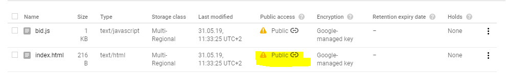

# Serverless

Damit das Bid-App Team sich nicht mehr um Skalierung und Docker kümmern muss, möchte man die App nun mit einem Severless Ansatz umsetzten.

Das Ziel dieser Übung:

- Google Functions und Serverless Technologien kennen lernen

## 1. Projekt erstellen

Erstelle ein neues Google Cloud Projekt mit dem Namen `cascld`.

## 2. Datastore erstellen

Die Daten in dieser Übung werden in einem Google Datastore (NoSQL Datenbank) gespeichert, weil dies einfacher ist, als der Zugriff auf Redis.

1. Suche nach Datastore
2. Erstelle ein Google Datastore (Select `DATASTORE MODE`)
3. Location `eur3` auswählen

## 3. Google Functions erstellen

In dieser Übung werden zwei Funktionen erstellt:

- Eine Funktion die Gebote entgegen nimmt `bid`
- Eine Funktion die das höchste Gebot zurückgibt `get-highest-bid`

### Get Highest Bid Function

1. Suche nach Cloud Function
2. Erstelle eine Funktion mit dem Namen `get-highest-bid`
3. Environment: `2nd gen`
4. Region: `europe-west6` Schweiz :)
5. `Allow unauthenticated invocations` und `HTTP` als Trigger type
6. Runtime: `Node.js 18`
7. Der Quellcode für die Funktion ist unten aufgeführt:

**index.js**

```js
const functions = require('@google-cloud/functions-framework');
const { Datastore } = require("@google-cloud/datastore");

// Verwendet Datastore des Projekts
const datastore = new Datastore();

functions.http('getHighestBid', async (req, res) => {
  console.log("getHighestBid", req);

  const key = datastore.key(["bids", "bid"]);

  const entities = await datastore.get(key);

  console.log("Entities from datastore", entities);

  const result = {
    highest: entities[0] == null ? 0 : entities[0].bid,
    hostname: "Google Functions",
  };

  res.set("Content-Type", "application/json");
  res.set("Access-Control-Allow-Origin", "*");
  res.set("Access-Control-Allow-Methods", "GET, POST");
  res.status(200).send(result);
});
```

**package.json**

```json
{
  "dependencies": {
    "@google-cloud/functions-framework": "3.0.0",
    "@google-cloud/datastore": "7.5.1"
  }
}
```

9. Entry point: `getHighestBid`
10. Teste die Funktion z.B. mit `curl YOUR-CLOUD-FUNCTION-URL`

Die Funktion sollte folgendes zurückgeben:

```json
{ "highest": 0, "hostname": "Google Functions" }
```

### Bid Function

Erstelle analog zur `get-highest-bid` Funktion eine Funktion mit dem Namen `bid`.

Der Code dazu ist unten aufgeführt. Bei Function to execute (Entry point) muss `bid` eingetragen werden.

**index.js**

```js
const functions = require('@google-cloud/functions-framework');
const { Datastore } = require("@google-cloud/datastore");

const datastore = new Datastore();

functions.http('bid', async (req, res) => {
  const bid = req.body;

  console.log("Bid from user:", bid);

  const key = datastore.key(["bids", "bid"]);
  const entity = {
    key: key,
    data: bid,
  };

  await datastore.save(entity);

  res.set("Content-Type", "application/json");
  res.set("Access-Control-Allow-Origin", "*");
  res.set("Access-Control-Allow-Methods", "GET, POST");
  res.set("Access-Control-Allow-Headers", "Content-Type");
  res.status(200).send(bid);
});
```

**package.json**

```json
{
  "dependencies": {
    "@google-cloud/functions-framework": "3.0.0",
    "@google-cloud/datastore": "7.5.1"
  }
}
```

Du kannst die Funktion mit folgendem Input testen:

```sh
curl -X POST YOUR-CLOUD-FUNCTION-URL -H "Content-Type: application/json" -d '{"bid": 3}'
```

Die Funktion sollte folgenden Output generieren:

```json
{ "bid": 2 }
```

## 4. Bid Webseite

Die beiden Google Cloud Functions sollten nun über das Internet erreichbar sein. Nun gehts darum, die Bid Webseite im Internet verfügbar zu machen. Die Bid Webseite greift über HTTP Requests auf die beiden Funktionen zu.

Die Webseite wird in einem Google Bucket gehostet (ähnlich wie Amazon S3 Bucket).

### Webseite Google Function URLs anpassen

Lade die Dateien im Ordner [website](serverless/website) herunter.

1. Passe die URLs in der Datei bid.js an

```js
const getHighestBidUrl = "YOUR-CLOUD-FUNCTION-URL";
const bidUrl = "YOUR-CLOUD-FUNCTION-URL";
```

Nun sollte die Webseite lokal funktionieren.

### Webseite auf Google Bucket hochladen

1. Suche nach `Cloud Storage`
2. Erstelle einen Bucket mit dem Namen `cascld`
3. Deaktivere `Prevent public access` damit die Daten aus dem Internet zugreifbar sind
3. Ändere die Berechtiung das Jeder den Inhalt des Buckets lesen kann
4. Permissions Tab -> Add member -> `allUsers` und Role `Storage Object Viewer`
5. Lade die Webseite hoch

Die Bid App sollte nun über das Internet erreichbar sein.



## Bonus: 5. Pricing

Finde heraus, wie viel es pro Monat kostet, die Bid App in dieser Art zu betreiben.

Die Preisberechnung basierd auf folgenden Angaben:

- Pro Tag wird die Webseite 400'000 mal aufgerufen
- Pro Tag werden 10'000 Gebote abgegeben
